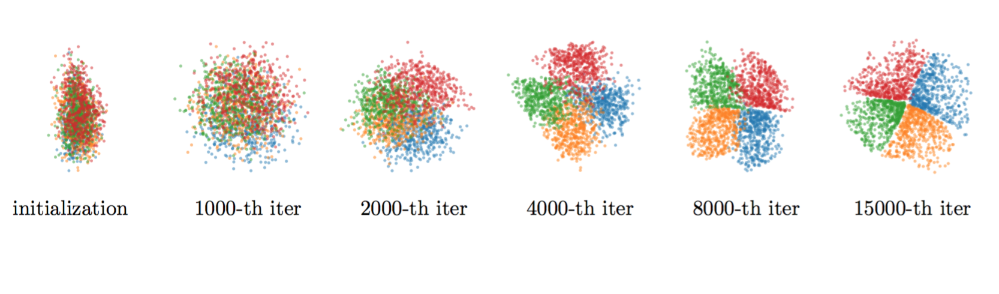

Code for Coupled Variational Bayes via Optimization Embedding (http://papers.nips.cc/paper/8177-coupled-variational-bayes-via-optimization-embedding.pdf)

# 1. Setup

Get the source code, and do pip install:

    git clone --recursive https://github.com/Hanjun-Dai/cvb
	cd cvb
	pip install -e .

Download the data via the dropbox link:

https://www.dropbox.com/sh/ho3tntcr0a7jsp4/AACpmE_3ErMw2JV3y9Kr8bTXa?dl=0

And create a symbolic link to this dropbox folder. 
Finally the folder structure should look like this:

    cvb (project root)
    |__  README.md
    |__  cvb
    |__  dropbox  -> symbolic link
    |__  |__ data
    |    |......
    |......
    

# 2. Run synthetic data

Directly run the script: 

    cd cvb/toy_img
	./run_fenchel.sh
	
You will get a sequence of posterior samples.

# 3. Run MNIST and CelebA

There are several variants of the model. 

For MNIST, we implemented cvb with gaussian, parametric optimization and also gaussian + fenchel duality;

For CelebA, we implemented cvb with parametric optimization and fenchel duality

To run the training:

    cd cvb/celeb
	./run_celeb_parametric_opt.sh
    
To visualize the image samples:

    cd cvb/celeb
    ./vis_celeb_parametric_opt.sh

# Reference

    @inproceedings{dai2018coupled,
      title={Coupled Variational Bayes via Optimization Embedding},
      author={Dai, Bo and Dai, Hanjun and He, Niao and Liu, Weiyang and Liu, Zhen and Chen, Jianshu and Xiao, Lin and Song, Le},
      booktitle={Advances in Neural Information Processing Systems},
      pages={9712--9722},
      year={2018}
    }

